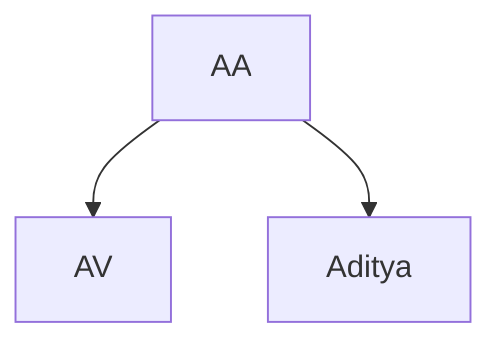

    

    <h3> 2). Aditya = AV </h3>
    
 Thats what she said! 

    

## The AA Law 

### Statement

Two humans named Aditya and AV are equal to each other :thumbsup:

### Explanation

AA Law is pretty straight forward. As the statements says, AV and Aditya are two humans. Hence they took their first letters and thus named the law "AA". The flowchart below makes it easier to understand.

Coming back -- the next point states that they are equal to each other. What does that mean? Are they the same human beings? Defenitely not! It states that both of them are equal to each other as they resemble each other quality wise and the share the beautiful bond of bromancing :sunglasses.

### Proof

The following derivation proves this law.

- Given that **AV** and **Aditya** are two humans
- From [Particle Law](Laws/../Particle.md), which states that each particle is made up of hxnamb. Thus we prove that Aditya = Hxnamb and AV = Hxnamb

$$AV = HXNAMB$$ 

$$Aditya = HXNAMB$$

$$Aditya = HXNAMB = AV $$

- Divide Equation 3 by HXNAMB

$${AV = HXNAMB = ADITYA} \over HXNAMB$$

$$\implies HXNAMB {(AV = ADITYA)} \over HXNAMB$$

- Cancel out HXNAMBs from numerator and denominator

$$\implies AV = ADITYA$$

Hence Proved :sunglasses: 

---